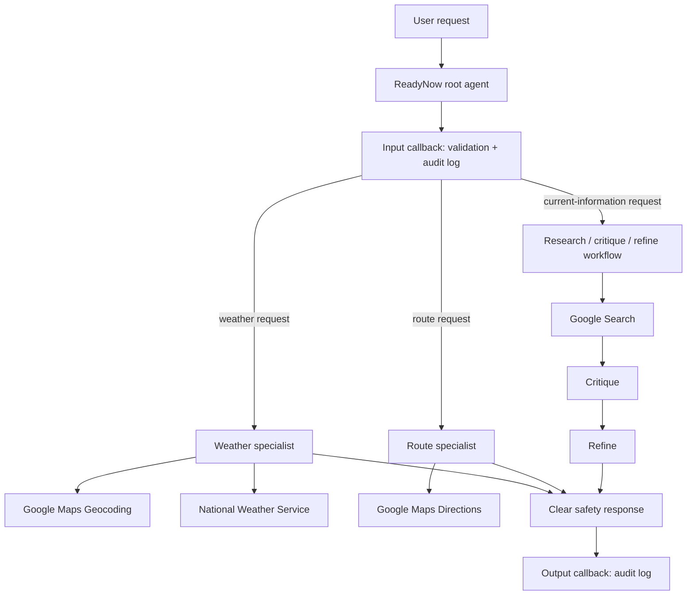

# Agent Development Kit Skills Validation Workshop

This repository contains the Jupyter notebooks for the ADK Skills Validation Workshop.
Each notebook is self-contained, requests secrets only at runtime, and includes a test cell.

## ReadyNow architecture

## Safety and secret handling

- Google Maps credentials are read from `GOOGLE_MAPS_API_KEY` or requested at runtime.
- No API keys, passwords, tokens, or lab credentials are stored in this repository.
- The ReadyNow agent uses official weather, mapping, and search tools; it tells users to follow official emergency instructions.
