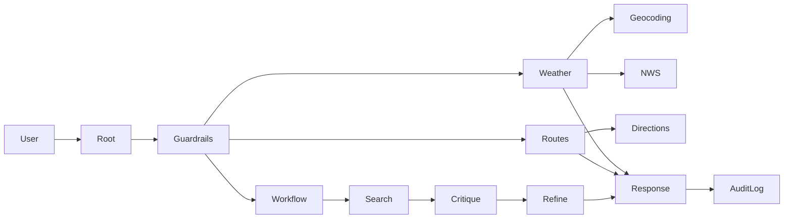

# ReadyNow architecture

The root agent validates and logs each request. It delegates real-time U.S. weather requests to the weather specialist, route-to-safety requests to the route specialist, and general emergency-preparedness research to a sequential search, critique, and refinement workflow. Each final response is logged.

